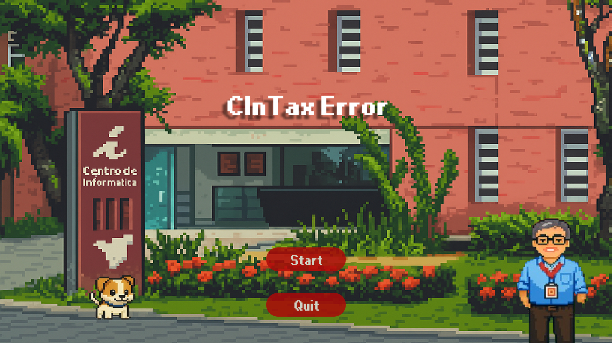
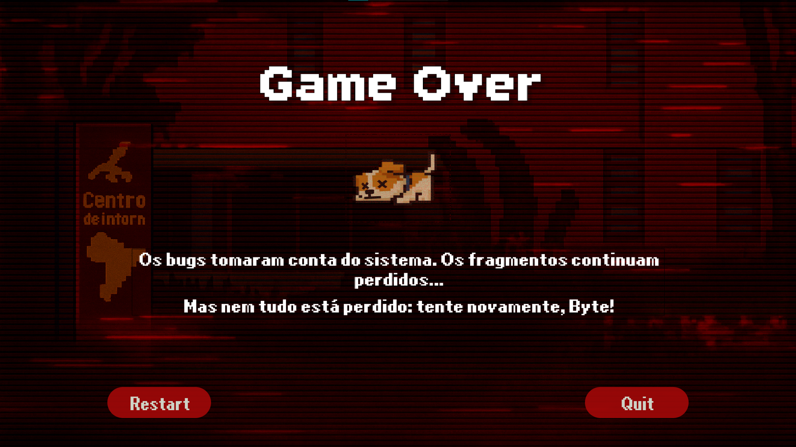
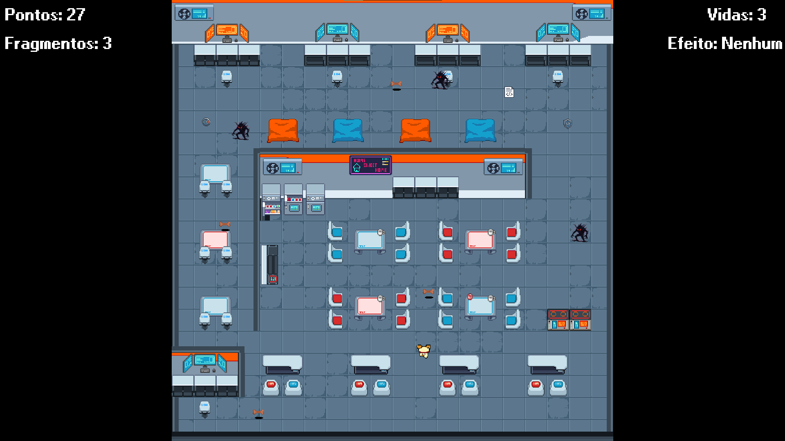

# 🐶 Byte Adventure

## 👥 Membros da Equipe - Responsabilidades

* Cauan – Game Designer, Programador, Efeitos Sonoros
* Rebeca – Programadora, Documentação, Apresentação
* Pedro – Programador, Designer de Mapas, Personagens e Coletáveis
* Yasmim – Designer de Mapas, Personagens e Coletáveis
* Caio – Designer de Mapas, Personagens e Coletáveis

---

## 📖 Descrição do Projeto

**Byte Adventure** é um jogo 2D desenvolvido em Python usando Pygame, no qual o jogador controla **Byte**, um cachorro aventureiro que precisa coletar petiscos espalhados pelo mapa enquanto evita inimigos.
A mecânica central envolve movimentação, colisões, perseguição de inimigos e coleta de itens.

---

## 🏗️ Arquitetura do Projeto

O código foi organizado de forma modular, separando responsabilidades:

```
📁 projeto
 ├── main.py              # Ponto de entrada do jogo
 ├── ui/
 │    ├── Fluxo.py        # Gerenciamento de telas e fluxo do jogo
 │    └── Botao.py        # Classe Botão
 │    └── ConfigsTela.py  # Configurações centrais do jogo
 ├── entidades/
 │    ├── Player.py       # Lógica do personagem
 │    ├── Inimigo.py      # Lógica dos inimigos
 │    └── Coletavel.py    # Lógica dos itens coletáveis
 |    └── Obstaculo.py    # Lógica dos obstaculos
 ├── niveis/              # Gerenciamento de níveis
 │    └── Niveis.py       
 │    └── Transicoes.py       
 ├── imagens/             # Sprites e telas do jogo
 ├── data/maps/           # Mapas criados no Tiled (.tmx)
 ├── requirements.txt     # Dependências do projeto
 └── README.md            # Documentação
```

Essa organização segue o princípio de **responsabilidade única**, facilitando manutenção e expansão do código.

---

## 🖼️ Galeria de Capturas de Tela

*(Inserir imagens do jogo rodando aqui)*




---

## 🛠️ Ferramentas e Tecnologias Utilizadas

| Ferramenta / Biblioteca | Uso                              | Justificativa                                            |
| ----------------------- | -------------------------------- | -------------------------------------------------------- |
| Python 3.x              | Linguagem principal              | Fácil aprendizado e integração com bibliotecas gráficas  |
| Pygame                  | Criação de jogos 2D              | Simples, bem documentado, ideal para projetos acadêmicos |
| PyTMX                   | Leitura de mapas Tiled           | Permite usar mapas externos de forma prática             |
| Tiled Map Editor        | Edição de mapas                  | Interface visual para criar cenários do jogo             |
| Git / GitHub            | Controle de versão e repositório | Organização e histórico do desenvolvimento               |
---

## 📚 Conceitos Aplicados da Disciplina

* **Programação Orientada a Objetos** — Classes para Player, Inimigo, Coletável e Botão.
* **Modularização** — Separação do código em múltiplos arquivos conforme responsabilidade.
* **Controle de Fluxo** — Laços e condicionais para movimentação e IA dos inimigos.
* **Manipulação de Eventos** — Uso de eventos do Pygame para capturar entrada do teclado.
* **Colisões** — Implementadas para coletar itens e detectar proximidade com inimigos.
* **Trabalho com Bibliotecas Externas** — Pygame e PyTMX para manipulação de gráficos e mapas.

---

## ⚠️ Desafios, Erros e Lições Aprendidas

### ❌ Maior Erro

**Erro:** Colisões mal calibradas entre Byte e inimigos, causando perseguição antes do previsto.
**Solução:** Ajuste da área de detecção usando retângulos menores no Pygame.

### 🏔️ Maior Desafio

**Desafio:** Integrar mapas do Tiled com PyTMX sem quebrar a lógica de movimentação.
**Solução:** Estudo da documentação e adaptação das coordenadas para o sistema do jogo.

### 📘 Lições Aprendidas

* Planejar melhor a arquitetura antes de começar a programar.
* A importância de separar responsabilidades para evitar conflitos no código.
* Uso de controle de versão (Git) para trabalhar em grupo de forma organizada.
* Testar incrementos pequenos ao invés de grandes blocos de código.

---

## 📦 Instalação e Execução

### 1️⃣ Pré-requisitos

* **Python 3.x** instalado → [Download Python](https://www.python.org/downloads/)
* **Pip** (gerenciador de pacotes do Python)

### 2️⃣ Clonar o repositório

```bash
git clone https://github.com/RebecaRSS-Dev/CinTaxError.git
cd CinTaxError
```

### 3️⃣ Criar ambiente virtual *(opcional, mas recomendado)*

```bash
python -m venv venv
# Linux/Mac
source venv/bin/activate
# Windows
venv\Scripts\activate
```

### 4️⃣ Instalar dependências

```bash
pip install -r requirements.txt
```

### 5️⃣ Executar o jogo

```bash
python3 main.py
```

---

## 📋 Dependências


```txt
pygame
pytmx
```

